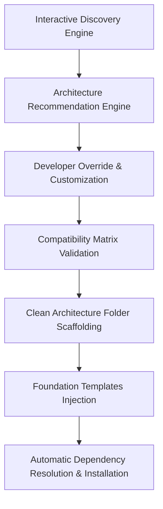

# Ironship ⚓

[](https://pub.dev/packages/ironship) [](https://dart.dev) [](https://flutter.dev) [](LICENSE) [](#)

Developer-first Flutter scaffolding CLI that generates production-ready architecture, foundation templates, and feature modules.

Ironship (formerly Flutter Forge) is a powerful developer-first command-line interface (CLI) for Flutter. It is designed to eliminate project initialization friction and enforce Clean Architecture standards. By automating baseline project setups, configuration directory layouts, core dependencies installation, and layered feature scaffolding, Ironship saves hours of development configuration on Day 0.

---

## Why Ironship?

Every mobile developer face structural hurdles when starting a new Flutter project:
- **Repetitive Flutter setup**: Initializing files, configuring build targets, and executing boilerplate terminal scripts.
- **Recreating architecture**: Setting up directory structures, routing templates, and configuration paths manually.
- **Recreating boilerplate**: Writing base HTTP clients, exception handlers, and custom logging wrappers.
- **Manual folder creation**: Manually configuring presentation, domain, and data layers every time a new feature is added.
- **Dependency setup**: Correctly linking, adding, and resolving required packages like `dio` to ensure basic configurations compile.

Ironship solves these problems by providing immediate scaffolding:
*   **Rapid Initialization**: Auto-validates your system SDK, runs standard Flutter project creation, and sets up directories in one step.
*   **Clean Architecture**: Bootstraps decoupling configurations, routing tables, and core layers.
*   **Foundation Boilerplate**: Injects ready-to-use classes for network requests and application-level exceptions.
*   **Automatic Dependency Resolution**: Pulls in essential base packages to ensure newly generated apps compile out-of-the-box.
*   **Zero Locking**: Generates standard Dart and Flutter files with absolutely no proprietary runtimes or tool locks.

---

## Features

*   ✅ **Project generation**: Validates system environment and bootstraps a clean Flutter application.
*   ✅ **Clean architecture injection**: Organizes structure separating config layers, core infrastructure, and modules.
*   ✅ **Foundation template generation**: Generates baseline classes like `dio_client.dart` and `app_exception.dart`.
*   ✅ **Automatic dependency installation**: Installs required external libraries automatically.
*   ✅ **Feature generation**: Recursively structures data, domain, and presentation packages for new features.
*   ✅ **Duplicate protection**: Built-in verification logic blocks accidental overwriting of existing projects or modules.

---

## Installation

Global installation.

```bash
dart pub global activate ironship
```

---

## PATH Setup

### macOS (zsh)

```bash
echo 'export PATH="$PATH:$HOME/.pub-cache/bin"' >> ~/.zshrc

source ~/.zshrc
```

### Linux

```bash
echo 'export PATH="$PATH:$HOME/.pub-cache/bin"' >> ~/.bashrc

source ~/.bashrc
```

### Windows

To configure the PATH environment variable on Windows:
1. Open the **Start Menu** and search for **Environment Variables**.
2. Select **Edit the system environment variables**.
3. Click the **Environment Variables...** button.
4. Under **User variables**, select `Path` and click **Edit**.
5. Click **New** and add the following directory path:
   ```text
   %USERPROFILE%\AppData\Local\Pub\Cache\bin
   ```
6. Click **OK** on all windows to save the changes, then restart your terminal.

---

## Quick Start

```bash
# View help options
forge --help

# Initialize project
forge init hospital_app

cd hospital_app

# Add feature modules
forge add feature auth

forge add feature dashboard

# Validate setup
flutter analyze
```

---

## Generated Architecture

Clean architecture layout generated by Ironship:

```text
my_app/
└── lib/
    ├── main.dart             # Main entry point (generated by Flutter)
    ├── app/                  # Application-wide routing and configuration
    │   ├── config/           # General application configs
    │   └── routes/           # Application-wide routes
    ├── core/                 # Shared infrastructure layers
    │   ├── exceptions/       # Custom Exception definitions and mapper
    │   │   ├── app_exception.dart
    │   │   └── exception_mapper.dart
    │   ├── network/          # Networking client and api result wrapper
    │   │   ├── api_result.dart
    │   │   └── dio_client.dart
    │   ├── services/         # Application helper services
    │   ├── storage/          # Local storage wrappers
    │   └── utils/            # Shared utilities
    └── features/             # Business modules (scaffolded via CLI)
        └── <feature_name>/
            ├── data/         # Repositories implementations, models, and data sources
            │   ├── datasources/
            │   ├── models/
            │   └── repositories/
            ├── domain/       # Entities, usecases, and repository interfaces
            │   ├── entities/
            │   ├── repositories/
            │   └── usecases/
            └── presentation/ # View layer (screens, widgets, state controllers)
                ├── screens/
                ├── state/
                └── widgets/
```

Brief breakdown:
*   `lib/app/`: Handles application-level routing tables and configuration files.
*   `lib/core/`: Houses reusable cross-cutting infrastructure logic shared across different features.
*   `lib/features/`: Contains business feature modules divided into domain, data, and presentation folders.

---

## Architecture Pipeline

When you run `forge init <project_name>`, Ironship executes a structured architecture staging pipeline to prepare your codebase:



1. **Interactive Discovery**: Collects functional requirement metrics (app scale, screen count, auth requirements, session persistence, environments).
2. **Architecture Recommendation**: Evaluates inputs against the Compatibility Matrix to recommend the optimal tech stack (Riverpod/Bloc, Go Router, secure session strategies, multi-environment setups).
3. **Developer Override**: Displays recommendations and allows you to customize state management, routing, session storage, and environments.
4. **Compatibility Validation**: Verifies dependencies and selections to block invalid or conflicting configurations.
5. **Folder & Template Scaffolding**: Scaffolds decoupled directories and writes production-ready base files (`dio_client.dart`, `app_exception.dart`, `api_result.dart`).
6. **Dependency Installation**: Injects and resolves the necessary packages automatically through the Flutter SDK.

---

## Developer Experience (DX)

Ironship is designed to make Day 0 Flutter setup extremely simple and robust:
* **Zero Runtime Dependencies**: The scaffolded code is 100% standard Dart/Flutter. Once generated, the project has zero runtime coupling or dependencies on the Ironship CLI.
* **Instant Feature Scaffolding**: Avoid repetitive folder creation. Create complete data/domain/presentation Clean Architecture feature packages in a single command.
* **Duplicate Protection**: Safety mechanisms prevent accidental overwriting of existing projects, modules, or templates.
* **Compile-Ready Out of the Box**: Automatically resolves and installs corresponding dependencies to ensure the initialized template immediately builds.

---

## Repository Links

* **GitHub Repository**: [kshitij-thakre/flutter-forge](https://github.com/kshitij-thakre/flutter-forge)
* **Issue Tracker**: [kshitij-thakre/flutter-forge/issues](https://github.com/kshitij-thakre/flutter-forge/issues)
* **Documentation**: [kshitij-thakre/flutter-forge/tree/main/doc](https://github.com/kshitij-thakre/flutter-forge/tree/main/doc)

---

## Verification

Provide E2E verification flow.

```bash
forge

forge init demo_app

cd demo_app

flutter analyze

forge add feature auth
```

Expected result:

No issues found.

---

## Roadmap

Upcoming features and improvements planned for future releases:
- **CI/CD support**: Pre-configured setup pipelines (GitHub Actions, GitLab CI).
- **Flavor management**: Native configurations for environment flavors (Dev, Staging, Prod).
- **Environment management**: Configurable runtime settings and env file configurations.
- **Testing workflows**: Scaffolded unit tests, integration test configurations, and testing templates.

---

## Contributing

Contributions are welcome! Please review [CONTRIBUTING.md](CONTRIBUTING.md) to learn how to open issues, implement features, or submit pull requests.

---

## License

MIT License. See [LICENSE](LICENSE) for more details.

---

<p align="center">Built with ❤️ for Flutter developers.</p>
