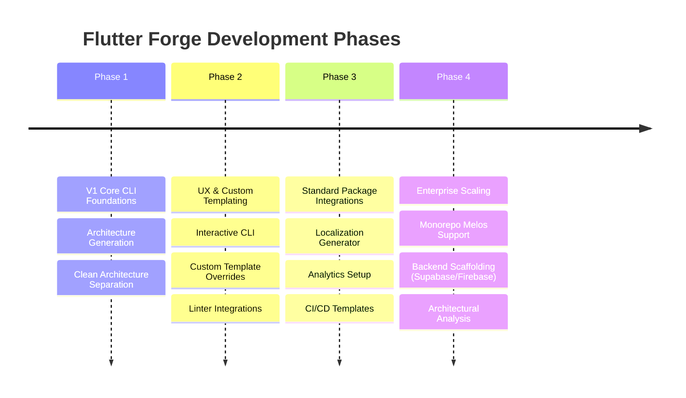

# Roadmap: Flutter Forge 🚀

This document outlines the evolutionary phases of Flutter Forge, detailing our progression from a core local scaffolding CLI tool to a robust enterprise-grade orchestration tool.

---

---

## 📍 Phase 1: V1 - Core CLI Foundations (Current)
*Focus: Architecture Generation, Consistency, and Zero Lock-in.*

*   [x] **CLI Basics**: Implement execution shell wrapper for `forge init` and `forge add feature`.
*   [x] **Folder Standardization**: Setup modular file outputs for Presentation, Domain, and Data feature layers.
*   [x] **Base Network Module**: Setup pre-configured Dio wrapper with token refreshing logic slots.
*   [x] **Error Pipeline**: Implement mapping wrapper translating network failures to core `AppException` formats.
*   [x] **Flavored Settings**: Multi-environment configurations via `.env` dynamic runtime setups.
*   [x] **Modular Router mapping**: Enable automatic route tree exports into the root `GoRouter` mapping configuration.

---

## 🎨 Phase 2: UX & Custom Templating (Upcoming)
*Focus: Customization, Interactive CLI, and Architectural Verification.*

*   **Interactive Command Prompts**: Transition to interactive CLI prompts when flags are omitted (e.g., prompting users for their state management preference).
*   **Custom Template Overrides**: Allow developers to place custom template files in a `.forge/templates/` root folder to override generated files with their own styles.
*   **Forge Linter Checks**: Introduce custom architectural linter rules (e.g., throwing static compilation errors if the Domain layer imports standard UI widgets or Data sources).
*   **Dry Run Support**: Introduce `--dry-run` to print the virtual directory tree and import changes before writing any code to disk.

---

## 🌐 Phase 3: Standard Package Integrations
*Focus: Automating secondary features that are out-of-scope in V1.*

*   **Localization Generator**: Command `forge add integration localization` to install localized assets configurations and setup boilerplate translations setup.
*   **Analytics Setup**: Command `forge add integration analytics` to bootstrap an abstract analytics routing mapper with implementations for major trackers.
*   **CI/CD Template Generator**: Add helper script generators config for:
    *   GitHub Actions (.github/workflows/main.yml) for automated builds & lint tests.
    *   GitLab CI & Codemagic settings.
*   **Fastlane Integration**: Add configuration templates for automated App Store and Play Store releases.

---

## 🏢 Phase 4: Enterprise Scaling
*Focus: Multi-package projects, Backend wrappers, and Cloud integration.*

*   **Monorepo Melos Integration**: Add support for building multi-package setups, separating core app wrappers from feature modules as individual micro-packages.
*   **Backend Scaffolding Add-ons**: Introduce optional installation setups for:
    *   **Firebase**: Dynamic dependency setup and remote config bindings.
    *   **Supabase**: Auto-generation of data models from database schemas.
*   **Cloud Architecture Audit**: Automatic checks inside terminal tools to suggest dependency improvements or highlight circular structures across modules.
