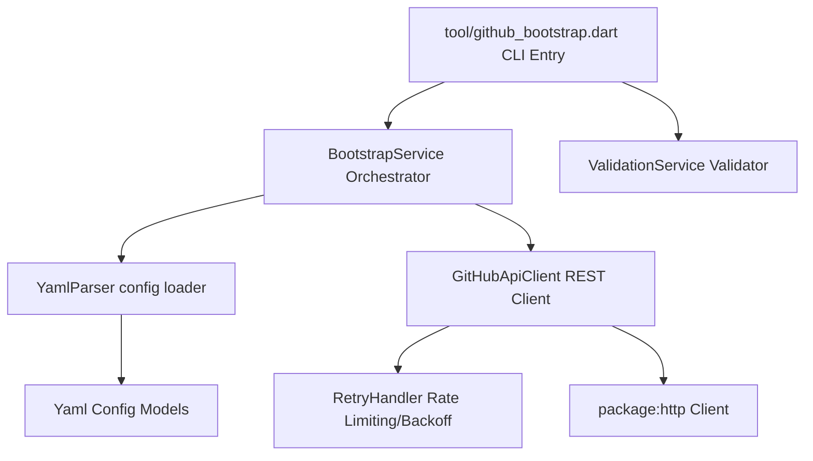

# Architecture Guide: GitHub Roadmap Bootstrap Tool

This document outlines the architectural patterns and layered decoupling principles guiding the implementation of the GitHub Roadmap Bootstrap tool.

---

## Architecture Blueprint

The bootstrap tool adheres to **Clean Architecture** rules, separating the presentation layer (CLI arguments parsing), business orchestration, and external system integrations.

---

## Component Directories

The implementation files are structured under `tool/github_bootstrap_impl/`:

### 1. Presentation & CLI Configuration
- **Entry point**: [tool/github_bootstrap.dart](file:///Users/kshitijthakre/Apps/flutter-forge/tool/github_bootstrap.dart)
- Responsibility: Directs user commands (`validate`, `dry-run`, `bootstrap`, `delete-release`), parses argument options, and binds dependencies.

### 2. Business Models
- **File**: [models.dart](file:///Users/kshitijthakre/Apps/flutter-forge/tool/github_bootstrap_impl/models.dart)
- Responsibility: Holds read-only data structures (`RoadmapConfig`, `MilestoneConfig`, `LabelConfig`, `IssueConfig`) mapping from configuration schemas.

### 3. YAML Configuration Parser
- **File**: [yaml_parser.dart](file:///Users/kshitijthakre/Apps/flutter-forge/tool/github_bootstrap_impl/yaml_parser.dart)
- Responsibility: Loads files using `package:yaml` and parses data. Enforces the Markdown template layout formatting for issue descriptions.

### 4. API Client Integration
- **File**: [github_api_client.dart](file:///Users/kshitijthakre/Apps/flutter-forge/tool/github_bootstrap_impl/github_api_client.dart)
- Responsibility: Coordinates HTTP requests with GitHub's REST endpoints, setting standard authorization headers and handling errors.

### 5. Resilient Retry Handler
- **File**: [retry_handler.dart](file:///Users/kshitijthakre/Apps/flutter-forge/tool/github_bootstrap_impl/retry_handler.dart)
- Responsibility: Retries transient exceptions (HTTP 5xx, SocketExceptions) and rate limiting locks (HTTP 403, 429) using customized backoff calculations and wait delays.

### 6. Validation Layer
- **File**: [validation_service.dart](file:///Users/kshitijthakre/Apps/flutter-forge/tool/github_bootstrap_impl/validation_service.dart)
- Responsibility: Runs syntax, schema reference validity (e.g. issues referencing invalid milestones), duplicate detection, and checks repository connectivity.

### 7. Core Sync Coordinator
- **File**: [bootstrap_service.dart](file:///Users/kshitijthakre/Apps/flutter-forge/tool/github_bootstrap_impl/bootstrap_service.dart)
- Responsibility: Compares existing remote state with configuration targets and issues requests to sync milestones, labels, and issues.
